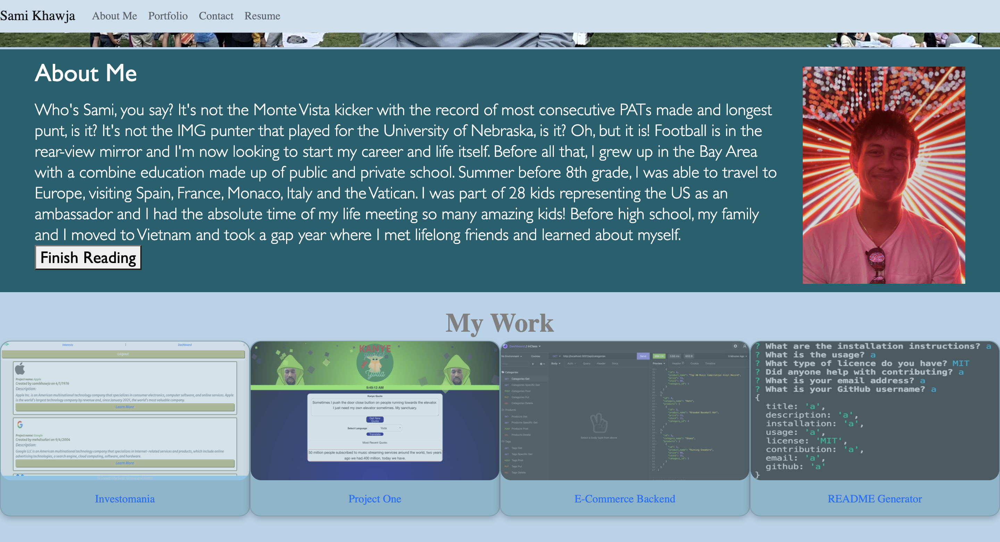

# Portfolio Page

<!-- TABLE OF CONTENTS -->

  
Table of Contents

  <ol>
    <li>
      <a href="#about-the-project">About The Project</a>
      <ul>
        <li><a href="#built-with">Built With</a></li>
      </ul>
    </li>
    <li><a href="#license">License</a></li>
    <li><a href="#contact">Contact</a></li>
    <li><a href="#acknowledgements">Acknowledgements</a></li>
  </ol>

<!-- ABOUT THE PROJECT -->
## About The Project

An updated portfolio! If you want to learn learn more about me and what I've been up to, <a href="https://samikhawja.github.io/portfolio_page/">click here</a>!

The websites I used to help create my portfolio are listed below in the <a href="#acknowledgements">acknowledgements</a>.

### Built With

We used <a href="https://code.visualstudio.com/">Visual Studio Code</a> to create the HTML, CSS and Javascript from scratch. We had the help of Foundation for formatting the HTML and JQuery to help with the coding on the Javascript!

<!-- LICENSE -->
## License

Distributed under the MIT License. See `LICENSE` for more information.

<!-- CONTACT -->
## Contact
Sami Khawja: Skhawja11@gmail.com

## Project Links
Project Link: [GitHub](https://github.com/samikhawja/portfolio_page)

Live Link: [Portfolio](https://samikhawja.github.io/portfolio_page/)

<!-- ACKNOWLEDGEMENTS -->
## Acknowledgements
* [W3Schools](https://www.w3schools.com/)
* [StackOverflow](https://stackoverflow.com/)
* [Mozilla](https://developer.mozilla.org/en-US/docs/Web/JavaScript)
* [Foundation](https://get.foundation)
* [JQuery](https://jquery.com/)